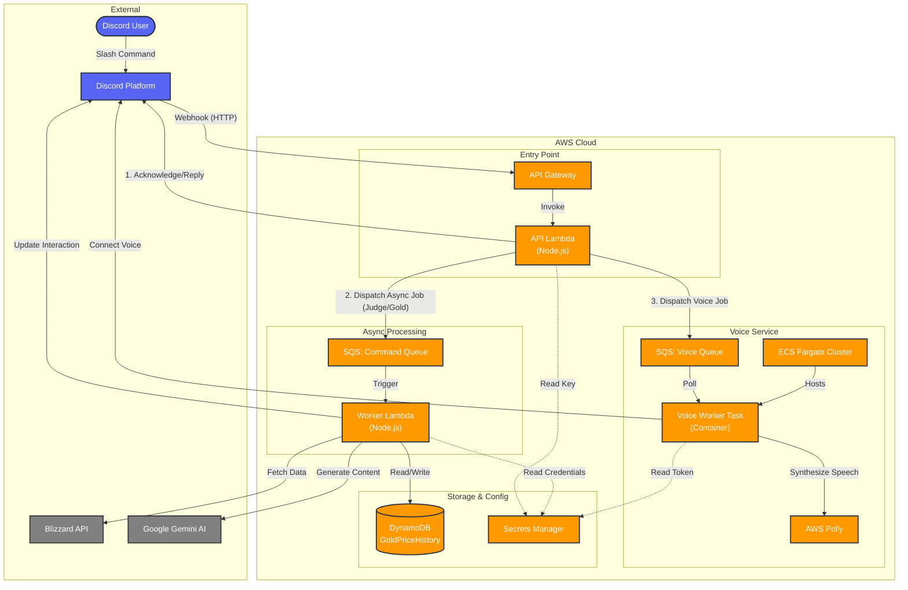

# Treant Architecture

This document describes the high-level architecture of the Treant Discord bot application.

## High-Level Overview

Treant is a serverless-first Discord bot application built on AWS. It uses a hybrid architecture:

- **Serverless (Lambda)** for handling slash commands and event-driven processing.
- **Microservices (ECS Fargate)** for long-running stateful voice connections.
- **Asynchronous Messaging (SQS)** to decouple components and handle heavy workloads.

## Architecture Diagram

## Component Details

### 1. API Handler (Synchronous)

- **Resource**: AWS Lambda (`src/api.ts`)
- **Trigger**: API Gateway (HTTP)
- **Responsibility**:
  - Validates Discord Ed25519 signatures.
  - Handles "ping" interactions.
  - fast-returning commands.
  - Enqueues heavy jobs to SQS to avoid timeout (Discord requires response within 3s).

### 2. Command Worker (Asynchronous)

- **Resource**: AWS Lambda (`src/worker.ts`)
- **Trigger**: SQS (`DiscordCommandQueue`)
- **Responsibility**:
  - Handles long-running logic (e.g., fetching WoW character data, gold prices, generating AI responses).
  - Uses **Gemini AI** for analysis and **Blizzard API** for game data.
  - Persists data to **DynamoDB**.
  - Updates the original Discord interaction via webhook.

### 3. Voice Worker (Stateful)

- **Resource**: AWS ECS Fargate
- **Trigger**: SQS (`VoiceCommandQueue`)
- **Responsibility**:
  - Maintains persistent connection to Discord Voice Channels.
  - Converts text to speech using **AWS Polly**.
  - Streams audio to Discord.
  - Runs inside a VPC with public internet access (no NAT gateway cost optimization).

### 4. Data & Configuration

- **DynamoDB**: Stores time-series data for gold prices.
- **Secrets Manager**: Securely stores Discord tokens, Blizzard credentials, and API keys.
